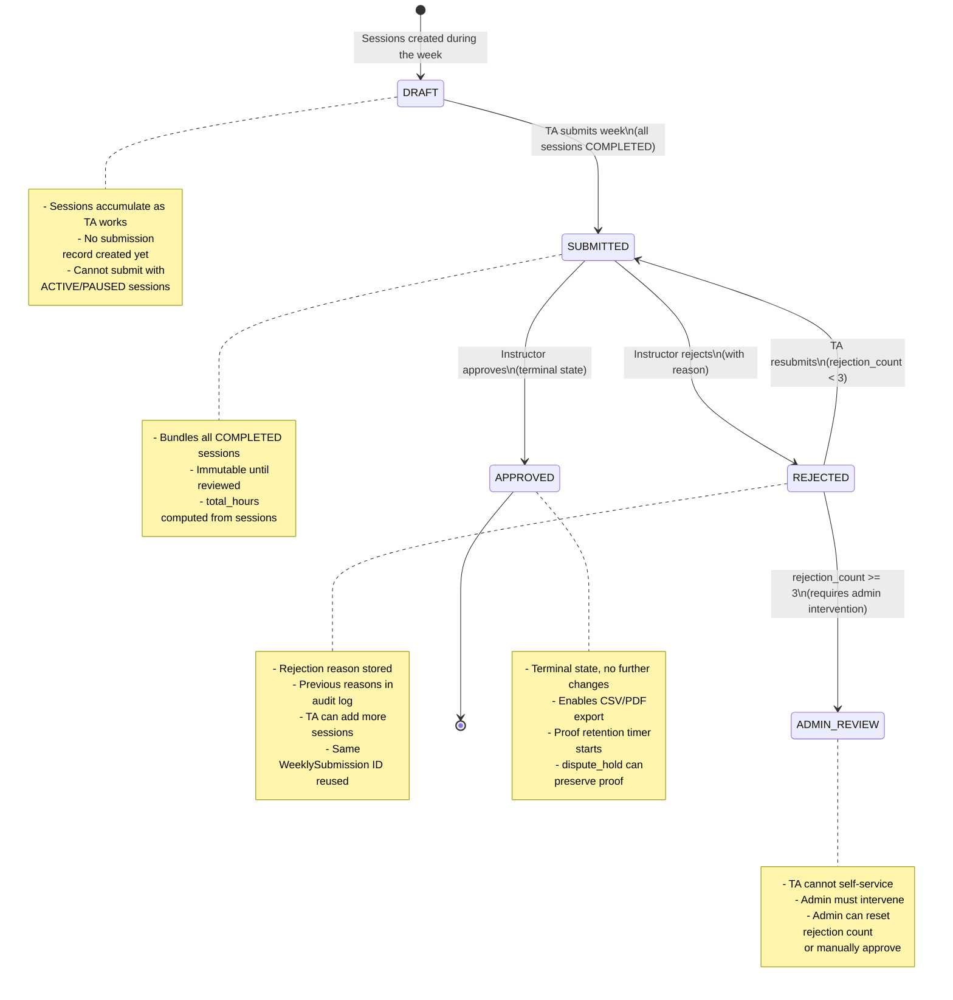

# NAU TA Timesheet Tracker — Validation Rules

Derived from the [Design Spec](superpowers/specs/2026-03-17-nau-timesheet-tracker-design.md).

---

## Field-Level Validation by Endpoint

### POST /api/sessions/start — Start a Work Session

| Field | Type | Required | Validation Rules | Error |
|-------|------|----------|-----------------|-------|
| `assignment_id` | UUID | Yes | Must be a valid UUID v4. Must reference an existing CourseAssignment. The authenticated user must be the owner of the assignment (`user_id` matches). The assignment role must be TA. | 400: Invalid UUID. 404: Assignment not found. 403: Not your assignment. |
| `category` | String (enum) | Yes | Must be one of: `GRADING`, `OFFICE_HOURS`, `LAB_PREP`, `TUTORING`, `MEETINGS`, `OTHER`. Case-sensitive. | 422: Invalid category. Allowed values: [...]. |
| `mode` | String (enum) | Yes | Must be one of: `SCREEN`, `IN_PERSON`. Case-sensitive. | 422: Invalid mode. Allowed values: SCREEN, IN_PERSON. |
| `client_timestamp` | ISO 8601 string | No | If provided, must be a valid ISO 8601 timestamp. Used for clock-drift detection. Server flags discrepancies > 30 seconds in the audit log. | 422: Invalid timestamp format. |

**Cross-field / global constraints:**
- The user must not have an existing ACTIVE session (any course). Violation: HTTP 409.

---

### POST /api/sessions/:id/pause — Pause a Session

| Field | Type | Required | Validation Rules | Error |
|-------|------|----------|-----------------|-------|
| `:id` (path) | UUID | Yes | Must be a valid UUID. Must reference an existing WorkSession. Session must be owned by the authenticated user. Session status must be ACTIVE. | 400/404/403/409 |
| `client_timestamp` | ISO 8601 string | No | If provided, valid ISO 8601. | 422 |

---

### POST /api/sessions/:id/resume — Resume a Session

| Field | Type | Required | Validation Rules | Error |
|-------|------|----------|-----------------|-------|
| `:id` (path) | UUID | Yes | Must be a valid UUID. Must reference an existing WorkSession. Session must be owned by the authenticated user. Session status must be PAUSED. | 400/404/403/409 |
| `client_timestamp` | ISO 8601 string | No | If provided, valid ISO 8601. | 422 |

---

### POST /api/sessions/:id/stop — Stop a Session

| Field | Type | Required | Validation Rules | Error |
|-------|------|----------|-----------------|-------|
| `:id` (path) | UUID | Yes | Must be a valid UUID. Must reference an existing WorkSession. Session must be owned by the authenticated user. Session status must be ACTIVE or PAUSED (not COMPLETED). | 400/404/403/409 |
| `description` | String | Yes | Required. Minimum 1 character, maximum 1000 characters. Trimmed of leading/trailing whitespace before length check. Must not be empty after trimming. | 422: Description is required. 422: Description must be between 1 and 1000 characters. |
| `client_timestamp` | ISO 8601 string | No | If provided, valid ISO 8601. | 422 |

---

### POST /api/sessions/:id/screenshots — Upload Screenshot

| Field | Type | Required | Validation Rules | Error |
|-------|------|----------|-----------------|-------|
| `:id` (path) | UUID | Yes | Must be a valid UUID. Must reference an existing WorkSession. Session must be owned by the authenticated user. Session mode must be SCREEN. Session status must be ACTIVE or PAUSED. | 400/404/403/422 |
| `file` | File (multipart) | Yes | Must be present. MIME type must be `image/jpeg` or `image/png`. Maximum file size: 5 MB (5,242,880 bytes). | 422: File is required. 422: Invalid file type (allowed: JPEG, PNG). 413: File too large (max 5MB). |
| `minute_mark` | Integer | Yes | Must be a positive integer (>= 0). Must be less than or equal to the session's current elapsed minutes. | 422: minute_mark must be a non-negative integer. 422: minute_mark exceeds session duration. |
| `client_timestamp` | ISO 8601 string | No | If provided, valid ISO 8601. | 422 |

---

### POST /api/sessions/:id/photos — Upload Photo Proof

| Field | Type | Required | Validation Rules | Error |
|-------|------|----------|-----------------|-------|
| `:id` (path) | UUID | Yes | Must be a valid UUID. Must reference an existing WorkSession. Session must be owned by the authenticated user. Session mode must be IN_PERSON. | 400/404/403/422 |
| `file` | File (multipart) | Yes | Must be present. MIME type must be `image/jpeg` or `image/png`. Maximum file size: 10 MB (10,485,760 bytes). | 422: File is required. 422: Invalid file type (allowed: JPEG, PNG). 413: File too large (max 10MB). |
| `caption` | String | Yes | Required. Minimum 1 character, maximum 500 characters. Trimmed of leading/trailing whitespace before length check. Must not be empty after trimming. | 422: Caption is required. 422: Caption must be between 1 and 500 characters. |

---

### POST /api/submissions/submit — Submit Weekly Hours

| Field | Type | Required | Validation Rules | Error |
|-------|------|----------|-----------------|-------|
| `assignment_id` | UUID | Yes | Must be a valid UUID v4. Must reference an existing CourseAssignment. The authenticated user must own the assignment. | 400/404/403 |
| `week_start` | Date (ISO 8601) | Yes | Must be a valid date in `YYYY-MM-DD` format. Must fall on a Monday (day of week = 1). Must not be in the future. | 422: Invalid date format. 422: week_start must be a Monday. 422: Cannot submit for a future week. |

**Cross-field / global constraints:**
- All sessions for this assignment + week must be COMPLETED. If any are ACTIVE or PAUSED: HTTP 422 with list of in-progress session IDs.
- There must be at least one COMPLETED session for this assignment + week. Violation: HTTP 422 "No completed sessions to submit."
- If this is a resubmission, the existing WeeklySubmission must be in REJECTED status. If in SUBMITTED or APPROVED status: HTTP 409.
- Rejection count must be < 3 for resubmission. If rejection count >= 3: HTTP 422 "Maximum rejections exceeded."

---

### POST /api/submissions/:id/approve — Approve a Submission

| Field | Type | Required | Validation Rules | Error |
|-------|------|----------|-----------------|-------|
| `:id` (path) | UUID | Yes | Must be a valid UUID. Must reference an existing WeeklySubmission. Submission status must be SUBMITTED. | 400/404/409 |

**Authorization:**
- The authenticated user must have role INSTRUCTOR or ADMIN.
- If INSTRUCTOR, they must have a CourseAssignment with role INSTRUCTOR for the submission's course.

---

### POST /api/submissions/:id/reject — Reject a Submission

| Field | Type | Required | Validation Rules | Error |
|-------|------|----------|-----------------|-------|
| `:id` (path) | UUID | Yes | Must be a valid UUID. Must reference an existing WeeklySubmission. Submission status must be SUBMITTED. | 400/404/409 |
| `rejection_reason` | String | Yes | Required. Minimum 1 character, maximum 1000 characters. Trimmed of leading/trailing whitespace before length check. Must not be empty after trimming. | 422: Rejection reason is required. 422: Rejection reason must be between 1 and 1000 characters. |

**Authorization:**
- Same as approve: INSTRUCTOR (for their course) or ADMIN.

---

### GET /api/export/:submissionId — Export Approved Hours

| Field | Type | Required | Validation Rules | Error |
|-------|------|----------|-----------------|-------|
| `:submissionId` (path) | UUID | Yes | Must be a valid UUID. Must reference an existing WeeklySubmission. Submission status must be APPROVED. | 400/404/422: Submission is not approved. |
| `format` (query) | String | Yes | Must be one of: `csv`, `pdf`. Case-insensitive. | 422: Invalid format. Allowed values: csv, pdf. |

**Authorization:**
- TA: Can only export own submissions.
- INSTRUCTOR: Can export submissions for courses they are assigned to.
- ADMIN: Can export any submission.

---

### PUT /api/admin/settings — Update System Settings

| Field | Type | Required | Validation Rules | Error |
|-------|------|----------|-----------------|-------|
| `key` | String | Yes | Must be one of the recognized setting keys: `idle_timeout_minutes`, `proof_retention_days`, `screenshot_interval_min`, `screenshot_interval_max`. | 422: Unknown setting key. |
| `value` | String | Yes | Type-specific validation based on key (see below). | 422: Invalid value for setting. |

**Value validation by key:**

| Key | Value Type | Constraints |
|-----|-----------|-------------|
| `idle_timeout_minutes` | Integer | Must be a positive integer. Minimum 1, maximum 60. |
| `proof_retention_days` | Integer | Must be a positive integer. Minimum 7, maximum 365. |
| `screenshot_interval_min` | Integer | Must be a positive integer. Minimum 1. Must be less than `screenshot_interval_max`. |
| `screenshot_interval_max` | Integer | Must be a positive integer. Must be greater than `screenshot_interval_min`. Maximum 30. |

**Authorization:** ADMIN only.

---

### PUT /api/admin/courses/:id/budget — Update Course Budget

| Field | Type | Required | Validation Rules | Error |
|-------|------|----------|-----------------|-------|
| `:id` (path) | UUID | Yes | Must be a valid UUID. Must reference an existing Course. | 400/404 |
| `hours_per_student` | Decimal | No | If provided, must be a positive decimal > 0. Maximum 2 decimal places. Reasonable upper bound: 10.0. | 422: hours_per_student must be a positive number. |
| `override_weekly_budget` | Decimal or null | No | If provided and not null, must be a positive decimal > 0. Maximum 2 decimal places. If explicitly set to `null`, the override is cleared and the computed formula is used. | 422: override_weekly_budget must be a positive number or null. |

**Authorization:** ADMIN only.

---

### POST /api/admin/invite — Invite a User

| Field | Type | Required | Validation Rules | Error |
|-------|------|----------|-----------------|-------|
| `email` | String | Yes | Must be a valid email address format (RFC 5322). Maximum 254 characters. Must not already be registered in the system. | 422: Invalid email format. 409: User with this email already exists. |
| `role` | String (enum) | Yes | Must be one of: `ADMIN`, `INSTRUCTOR`, `TA`. Case-sensitive. | 422: Invalid role. Allowed values: ADMIN, INSTRUCTOR, TA. |
| `course_id` | UUID | Conditional | Required when role is `INSTRUCTOR` or `TA`. Must be a valid UUID referencing an existing Course. Must not be provided when role is `ADMIN`. | 422: course_id is required for INSTRUCTOR and TA roles. 404: Course not found. 422: course_id should not be provided for ADMIN role. |

**Authorization:** ADMIN only.

---

## Common Validation Patterns

### UUID Validation
All UUID fields must match the format: `xxxxxxxx-xxxx-4xxx-yxxx-xxxxxxxxxxxx` where `y` is one of `[89ab]`. Invalid UUIDs return HTTP 400 with message: `"Invalid UUID format"`.

### Authentication
All endpoints require a valid JWT in the `Authorization: Bearer <token>` header. Missing or invalid tokens return HTTP 401: `"Authentication required"`.

### Authorization Hierarchy
| Role | Access Level |
|------|-------------|
| ADMIN | All endpoints, all data |
| INSTRUCTOR | Review endpoints for assigned courses, dashboard, export for assigned courses |
| TA | Session endpoints (own), submission (own), dashboard (own), export (own approved) |

Unauthorized access returns HTTP 403: `"Insufficient permissions"`.

### Rate Limiting (Recommended)
| Endpoint Group | Limit |
|---------------|-------|
| Authentication (login, refresh) | 10 requests / minute / IP |
| Screenshot upload | 20 requests / minute / user |
| All other endpoints | 60 requests / minute / user |

---

## WeeklySubmission Lifecycle — State Machine

### State Transition Rules

| From | To | Trigger | Constraints |
|------|----|---------|-------------|
| (none) | DRAFT | First session created for a course+week | Implicit; no API call creates the DRAFT record explicitly |
| DRAFT | SUBMITTED | `POST /api/submissions/submit` | All sessions for assignment+week must be COMPLETED. At least one session required. |
| SUBMITTED | APPROVED | `POST /api/submissions/:id/approve` | Reviewer must be INSTRUCTOR (for course) or ADMIN. |
| SUBMITTED | REJECTED | `POST /api/submissions/:id/reject` | Reviewer must be INSTRUCTOR (for course) or ADMIN. Rejection reason required. |
| REJECTED | SUBMITTED | `POST /api/submissions/submit` (resubmit) | Rejection count must be < 3. All sessions COMPLETED. Same submission ID reused. |
| REJECTED | ADMIN_REVIEW | Automatic | When rejection count reaches 3. No API transition; enforced by submit validation. |

### Invalid Transitions (Enforced by Server)

| Attempted Transition | HTTP Response |
|---------------------|---------------|
| SUBMITTED --> SUBMITTED (double submit) | 409: Submission already pending review |
| APPROVED --> REJECTED (undo approval) | 409: Cannot modify an approved submission |
| APPROVED --> SUBMITTED (resubmit approved) | 409: Submission is already approved |
| REJECTED --> APPROVED (skip review) | 409: Must resubmit before approval |
| DRAFT --> APPROVED (skip submit) | 409: Submission must be submitted first |
